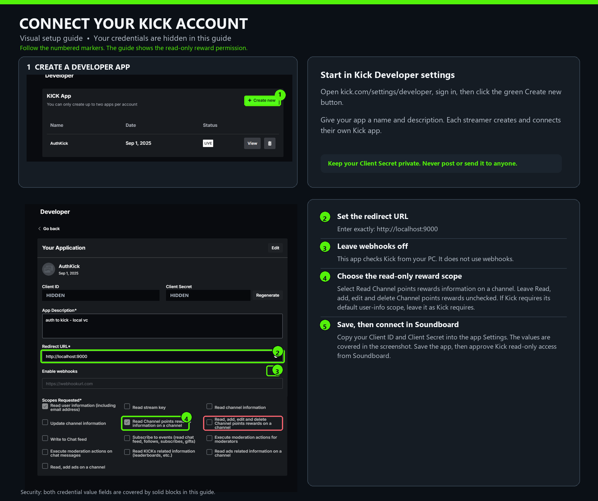
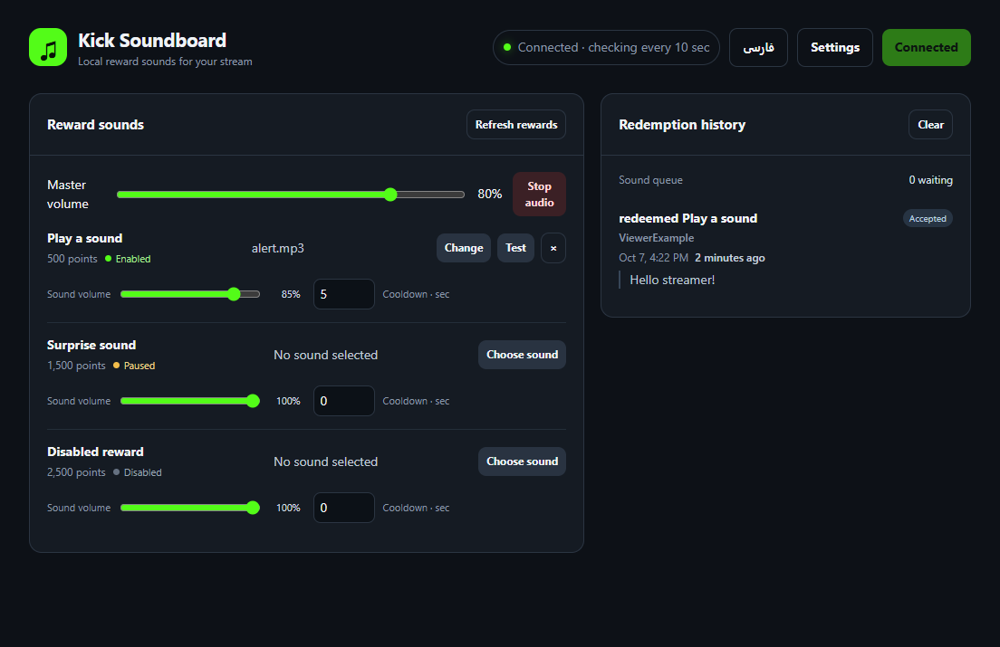
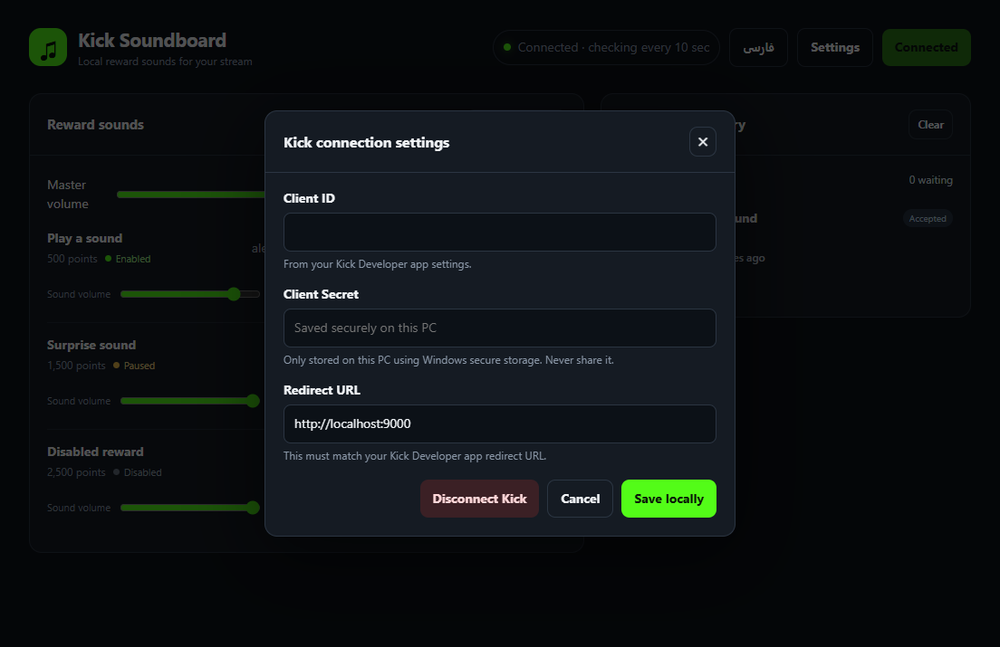

# Kick Soundboard

**Kick channel point rewards → sounds played on your Windows PC.** Kick Soundboard is a local Windows desktop app: it reads your channel rewards and their redemptions, then plays the audio file you assigned to a redeemed reward.

> Early preview · Windows x64 · English and فارسی · The app screenshots use fake data. The Kick Developer setup image is based on the provided screenshots; both credential values are fully covered.

**Language / زبان:** [English](#english) · [فارسی](#فارسی)  |  [Repository](https://github.com/MehdiMeidanshahi/Kick-Soundboard) · [Releases](https://github.com/MehdiMeidanshahi/Kick-Soundboard/releases)

## English

## Quick start

1. Download the latest Windows installer from the project's [Releases page](https://github.com/MehdiMeidanshahi/Kick-Soundboard/releases) and install it.
2. Sign in to Kick, open [Kick Developer settings](https://kick.com/settings/developer), and create your own app. Set the redirect URL to `http://localhost:9000`, enable **Read Channel points rewards information on a channel** (`channel:rewards:read`), and leave webhooks off. Save and copy that app's Client ID and Client Secret. **Keep the secret private.**
3. In Kick Soundboard, open **Settings**, enter the Client ID and Client Secret, and choose **Save locally**. Choose **Connect Kick** and approve the read-only access in Kick's browser page.
4. Choose an audio file for each reward and use **Test** to check it. Keep the app open while streaming; connect its Windows audio output to OBS if you want viewers to hear the sounds.

Each streamer connects their own Kick Developer app. The app runs locally and does not need your Client Secret sent to anyone else.



*Visual guide: both credential values are completely covered, and the correct read-only rewards permission is shown.*

## Screenshots



*App overview. All displayed rewards, names, and redemption text are examples.*



*Connection settings. The credential fields are intentionally blank.*

## What it does

- Loads the signed-in streamer's Kick channel point rewards and shows whether each reward is enabled, paused, or disabled.
- Lets you choose an audio file on your computer for each reward. Supported formats: MP3, WAV, OGG, M4A, AAC, and FLAC.
- Plays a mapped sound once for each new, non-rejected redemption ID. Sounds do not loop and play in arrival order in a queue; ten redemptions close together are kept and played one at a time. Duplicate redemption IDs are ignored. The queue shows total queued and waiting counts. **Stop audio** stops the current sound and clears the queue.
- Includes master and per-reward volume controls, a per-reward cooldown, a test button, and redemption history.
- Shows the installed app version in Settings and lets you check GitHub Releases for a newer version.
- Shows the redeemer and their optional message when Kick supplies those fields. Kick's current polling schema supplies the redeemer's numeric ID, not their username, so history normally displays the ID.
- Has English and Persian interfaces, including right-to-left layout.

## Download and connect

### 1. Download the app

Open the project's [Releases page](https://github.com/MehdiMeidanshahi/Kick-Soundboard/releases) and download `Kick-Soundboard-Setup-<version>.exe`. Run the installer; it installs for your Windows account and creates Start Menu and desktop shortcuts.

Only download the installer from this project's official [GitHub Releases page](https://github.com/MehdiMeidanshahi/Kick-Soundboard/releases). The early-preview installer is not code-signed, so Windows may show **Windows protected your PC** or an **Unknown publisher** warning. The warning cannot be removed without signing the installer with a trusted code-signing certificate. If you choose to continue, first confirm that the installer came from this repository's Releases page and verify its published SHA-256 checksum.

To update, close the app and run the newer installer. It uses the same app identity as earlier versions and upgrades that installation; local app data is preserved. Windows SmartScreen may still warn because the installer is unsigned. You can review the release and its SHA-256 checksum before running it.

### 2. Create your own Kick Developer app

Each streamer connects their own Kick Developer app to their own Kick account. This is needed because this version runs entirely on your PC: there is no project-owned sign-in server, and you should never send your Client Secret to the project owner or another streamer.

1. Sign in to Kick in your browser, then open [Kick Developer settings](https://kick.com/settings/developer) (**Settings → Developer**).
2. Choose **Create new**. Enter any name and description for your personal integration.
3. Set **Redirect URL** to this exact address: `http://localhost:9000`.
4. Leave **Enable webhooks** off. This app polls Kick from your PC and does not use webhooks.
5. Under **Scopes Requested**, allow **Read Channel points rewards information on a channel** (`channel:rewards:read`). The app asks Kick for this read-only scope only. If the developer page has a required/default user-information checkbox, leave it as Kick requires; the app does not request the `user:read` scope.
6. Do not select the separate permission that can read, add, edit, and delete channel point rewards. This soundboard only needs the read permission.
7. Save the app. In its details, copy the **Client ID** and **Client Secret**. Treat the Client Secret like a password; do not post it in GitHub, screenshots, chat, or support requests. If it was exposed, regenerate it in Kick.

Kick may limit how many Developer apps an account can create. If Kick reports that you reached its limit, this local-only version cannot use another streamer's secret safely. A shared sign-in service could avoid that setup, but would require a hosted backend; this app has none.

### 3. Connect Kick Soundboard

1. Open Kick Soundboard and choose **Settings**.
2. Paste your **Client ID** and **Client Secret** into the fields, then choose **Save locally**. The secret is stored on this PC using Windows secure storage; the app does not send it to the project owner.
3. Choose **Connect Kick**. Your browser opens Kick's authorization page. Review the requested read-only permissions and approve them.
4. Return to the app. The status indicator should say **Connected**, and your channel's rewards should appear. The app checks Kick about every 10 seconds, so a redemption may take up to roughly 10 seconds to appear and play.


### 4. Assign and adjust sounds

1. Find a reward in **Reward sounds** and choose **Choose sound**.
2. Pick an audio file from your computer. The app stores the file path; it does not copy or upload the audio. If you move or rename the file later, select it again.
3. Choose **Test** to preview it. Adjust **Sound volume** for that reward and **Master volume** for all sounds.
4. Set **Cooldown · sec** to add a minimum gap between plays of the same reward. Redemptions are kept in the queue during cooldown and will play when their turn arrives.
5. Use **Stop audio** to stop the current sound and clear waiting sounds. Redemption history is separate; **Clear** removes the displayed history.

### 5. Get the sound into your stream

Kick Soundboard plays through your Windows audio output. In OBS or other streaming software, capture the same output device—for example, with **Desktop Audio** or an **Audio Output Capture** source. Check your stream mix so you do not capture your microphone or other sounds unintentionally.

## While streaming

- Keep Kick Soundboard open, connected, and online during the stream. Closing the app stops polling and sound playback.
- The app only reads rewards and redemptions. It does not approve, reject, edit, or create rewards.
- New rejected redemptions are shown in history but do not play a sound. Rewards marked paused or disabled remain visible with their status indicator.
- If you want to disconnect, open **Settings → Disconnect Kick**. This clears the saved OAuth tokens from this PC and stops polling. To revoke Kick's authorization too, remove the app from Kick's connected-app/account settings.

## Privacy and security

- The local app makes HTTPS requests directly to Kick's OAuth and API services. There is no project-owned server receiving credentials, tokens, redemption history, or audio files, and there is no hosting fee for this local architecture. An internet connection to Kick is still required.
- The Client Secret and OAuth tokens are encrypted at rest with Electron's Windows secure-storage integration (DPAPI). Encryption at rest does not protect secrets from malware or other code already running as the same Windows user. Never share or commit your credentials.
- The app stores reward mappings, audio file paths, volume/cooldown settings, up to 100 history entries, and recent redemption IDs in its Windows user-data folder. It does not store copies of the audio files.
- A small HTTP server on `localhost:9000` serves the app and receives Kick's OAuth redirect. It checks the local app session token for API operations and is not a public server or webhook receiver.
- The Electron renderer runs with Node integration disabled, context isolation and sandboxing enabled, a restrictive Content Security Policy, and navigation/window-opening restrictions. Local API and audio routes require an app-session token. These measures reduce risk; no desktop app can guarantee safety if the PC itself is compromised.
- The packaging tool has a transitive `sprintf-js` dependency that `pnpm audit` flags. This repository applies a local input-validation patch; the patched code is build-time only and is not bundled into the Windows app. The audit tool still reports the upstream package version because the maintainer has not published a fixed release yet.
- Uninstalling preserves local app data. Disconnecting clears OAuth tokens, but the Client ID, encrypted Client Secret, settings, and history remain in the local data folder. To remove all local app data, close the app, open `%APPDATA%` in File Explorer, and remove the app's data folder (identify it by its `settings.json` file).

## Technical notes and limitations

- The official [Kick Channel Rewards API](https://docs.kick.com/apis/channel-rewards) provides the reward redemption data used here. The app uses the [Kick OAuth authorization-code flow with PKCE](https://docs.kick.com/getting-started/generating-tokens-oauth2-flow) and requests the read scopes documented by Kick.
- This version uses local polling every 10 seconds. It does not use Kick webhooks, which would need an internet-reachable receiver.
- Kick's current redemption schema exposes the redeemer's numeric `user_id` and does not include a username. The app therefore displays the viewer ID; asking for `user:read` would not add other viewers' usernames.
- If the app cannot start, another program may already be using port `9000`. Close that program or change both the app's redirect URL and its local port configuration before reconnecting.

## Build from source (Windows)

Requirements: Windows x64, Node.js 20 or newer, and pnpm.

```powershell
pnpm install
pnpm start
pnpm build:win
```

The Windows installer is written to `release/`. It is an unsigned early-preview build; Windows may show an unknown-publisher warning. See [electron-builder's NSIS guide](https://www.electron.build/docs/nsis/) for installer options.

## فارسی

**زبان / Language:** [فارسی](#فارسی) · [English](#english)  |  [مخزن پروژه](https://github.com/MehdiMeidanshahi/Kick-Soundboard) · [نسخه‌ها و دریافت](https://github.com/MehdiMeidanshahi/Kick-Soundboard/releases)

**پخش صدای بازخرید امتیازهای کانال کیک روی رایانهٔ ویندوزی شما.** Kick Soundboard یک برنامهٔ محلی ویندوز است. پاداش‌های کانال و بازخریدها را می‌خواند و هنگام بازخرید هر پاداش، فایل صدایی را که برای آن انتخاب کرده‌اید پخش می‌کند.

## راه‌اندازی سریع

۱. جدیدترین نسخهٔ ویندوز برنامه را از صفحهٔ [نسخه‌های پروژه](https://github.com/MehdiMeidanshahi/Kick-Soundboard/releases) دریافت و نصب کنید.
۲. وارد کیک شوید و [تنظیمات توسعه‌دهندگان کیک](https://kick.com/settings/developer) را باز کنید. یک برنامهٔ شخصی بسازید، نشانی بازگشت را `http://localhost:9000` بگذارید، دسترسی **Read Channel points rewards information on a channel** (`channel:rewards:read`) را فعال کنید و webhook را خاموش بگذارید. برنامه را ذخیره کنید و **Client ID** و **Client Secret** آن را بردارید. **رمز را محرمانه نگه دارید.**
۳. در Kick Soundboard وارد **Settings** شوید، شناسه و رمز را وارد کنید و **Save locally** را بزنید. سپس **Connect Kick** را انتخاب و دسترسی فقط‌خواندنی را در صفحهٔ کیک تأیید کنید.
۴. برای هر پاداش یک فایل صدا انتخاب کنید و با **Test** آن را بررسی کنید. هنگام استریم برنامه را باز نگه دارید؛ برای شنیده‌شدن صدا در OBS، خروجی صدای ویندوز برنامه را به صداهای استریم اضافه کنید.

هر استریمر برنامهٔ شخصی خودش را در Kick Developer وصل می‌کند. برنامه روی رایانهٔ خودتان اجرا می‌شود و لازم نیست Client Secret را برای کسی بفرستید.


*راهنمای تصویری؛ شناسه و رمز کلاینت کاملاً پوشانده شده‌اند و دسترسی صحیحِ فقط‌خواندنی پاداش‌ها نمایش داده شده است.*

> نسخهٔ آزمایشی · ویندوز ۶۴ بیتی · فارسی و انگلیسی · تصاویر برنامه داده‌های نمونه و ساختگی دارند. تصویر راهنمای Kick Developer از تصویرهای ارسالی ساخته شده و شناسه و رمز کلاینت در آن کاملاً پوشانده شده‌اند.

## تصاویر برنامه


*نمای کلی برنامه؛ نام‌ها، پاداش‌ها و بازخریدهای تصویر نمونه هستند.*


*تنظیمات اتصال؛ فیلدهای اطلاعات ورود عمداً خالی هستند.*

## امکانات

- پاداش‌های امتیازی کانال کیک را می‌خواند و وضعیت فعال، مکث‌شده یا غیرفعال هر پاداش را نشان می‌دهد.
- برای هر پاداش می‌توانید یک فایل صدا از رایانه انتخاب کنید. فرمت‌های MP3، WAV، OGG، M4A، AAC و FLAC پشتیبانی می‌شوند.
- هنگام مشاهدهٔ بازخرید جدید و ردنشده، صدا را فقط یک‌بار برای شناسهٔ همان بازخرید به صف می‌فرستد. صدا تکرار نمی‌شود و بازخریدها به‌ترتیب و یکی‌یکی پخش می‌شوند؛ شناسهٔ تکراری نادیده گرفته می‌شود. شمار کل موارد صف و موارد در انتظار نمایش داده می‌شود. دکمهٔ **Stop audio** صدای در حال پخش را متوقف و صف را پاک می‌کند.
- بلندی صدای اصلی و جداگانهٔ هر پاداش، مدت وقفه، دکمهٔ آزمایش صدا و تاریخچه دارد.
- نسخهٔ نصب‌شده را در Settings نشان می‌دهد و می‌توانید وجود نسخهٔ جدید را در GitHub بررسی کنید.
- نام بازخریدکننده و پیام او را در صورت ارسال کیک نمایش می‌دهد. در schema فعلی API کیک، بازخریدکننده فقط با شناسهٔ عددی `user_id` معرفی می‌شود و نام کاربری در پاسخ نیست؛ بنابراین معمولاً شناسهٔ بیننده نمایش داده می‌شود.
- رابط انگلیسی و فارسی دارد و در فارسی از راست به چپ نمایش داده می‌شود.

## دریافت و اتصال برنامه

### ۱. دریافت برنامه

وارد صفحهٔ [نسخه‌های پروژه در GitHub](https://github.com/MehdiMeidanshahi/Kick-Soundboard/releases) شوید و جدیدترین فایل `Kick-Soundboard-Setup-<version>.exe` را دانلود کنید. نصب‌کننده را اجرا کنید؛ برنامه برای حساب ویندوزی شما نصب می‌شود و میان‌بر منوی Start و دسکتاپ می‌سازد.

نصب‌کننده را فقط از صفحهٔ رسمی [نسخه‌های GitHub پروژه](https://github.com/MehdiMeidanshahi/Kick-Soundboard/releases) دریافت کنید. نصب‌کننده امضای دیجیتال ندارد؛ ممکن است ویندوز پیام **Windows protected your PC** یا هشدار **Unknown publisher** نشان دهد. برای حذف این هشدار باید نصب‌کننده با گواهی معتبر امضا شود. اگر تصمیم به ادامه دارید، مطمئن شوید فایل را از صفحهٔ Releases همین مخزن گرفته‌اید و SHA-256 منتشرشده را بررسی کنید.

برای به‌روزرسانی، برنامه را ببندید و نصب‌کنندهٔ نسخهٔ جدید را اجرا کنید. چون شناسهٔ نصب با نسخه‌های قبلی یکسان است، همان نصب به‌روزرسانی می‌شود و اطلاعات محلی برنامه حفظ می‌شود. ممکن است SmartScreen به‌دلیل امضانشدن نصب‌کننده همچنان هشدار دهد. پیش از اجرا می‌توانید نسخه و SHA-256 آن را بررسی کنید.

### ۲. ساخت برنامهٔ شخصی در Kick Developer

هر استریمر حساب کیک خودش را به برنامهٔ Developer خودش وصل می‌کند. چون این نسخه کاملاً روی رایانهٔ شما اجرا می‌شود، سرور ورود متعلق به پروژه ندارد. **Client Secret را برای سازندهٔ پروژه یا استریمر دیگری نفرستید.**

۱. در مرورگر وارد کیک شوید و [تنظیمات توسعه‌دهندگان کیک](https://kick.com/settings/developer) را باز کنید (**Settings → Developer**).
۲. **Create new** را بزنید و برای برنامهٔ شخصی خود یک نام و توضیح وارد کنید.
۳. نشانی **Redirect URL** را دقیقاً این مقدار قرار دهید: `http://localhost:9000`.
۴. گزینهٔ **Enable webhooks** را خاموش بگذارید. برنامه روی رایانهٔ شما کیک را بررسی می‌کند و webhook ندارد.
۵. در بخش **Scopes Requested** دسترسی **Read Channel points rewards information on a channel** (`channel:rewards:read`) را فعال کنید. خود برنامه فقط همین دسترسی خواندن را از کیک درخواست می‌کند. اگر کیک گزینهٔ پیش‌فرض اطلاعات کاربر را اجباری کرده، مطابق نیاز خود صفحه عمل کنید؛ برنامه scope به نام `user:read` را درخواست نمی‌کند.
۶. دسترسی جداگانه‌ای که امکان خواندن، افزودن، ویرایش و حذف پاداش‌های امتیازی را می‌دهد انتخاب نکنید؛ این برنامه فقط به دسترسی خواندن نیاز دارد.
۷. برنامه را ذخیره کنید. در جزئیات آن **Client ID** و **Client Secret** را بردارید. با Client Secret مثل رمز عبور رفتار کنید: آن را در GitHub، تصویر، چت یا درخواست پشتیبانی قرار ندهید. اگر افشا شد، در Kick آن را دوباره بسازید.

ممکن است Kick تعداد برنامه‌هایی را که هر حساب می‌تواند بسازد محدود کند. اگر به سقف رسیدید، این نسخهٔ کاملاً محلی نمی‌تواند با امنیت از Client Secret استریمر دیگری استفاده کند. سرویس ورود مشترک به یک بک‌اند میزبانی‌شده نیاز دارد؛ این پروژه چنین سروری ندارد.

### ۳. اتصال Kick Soundboard

۱. برنامه را باز کنید و **Settings** را بزنید.
۲. **Client ID** و **Client Secret** را وارد و **Save locally** را انتخاب کنید. رمز با حافظهٔ امن ویندوز روی همین رایانه ذخیره می‌شود و برای سازندهٔ پروژه ارسال نمی‌شود.
۳. **Connect Kick** را بزنید. صفحهٔ مجوز کیک در مرورگر باز می‌شود. دسترسی‌های فقط‌خواندنی را بررسی و تأیید کنید.
۴. به برنامه برگردید. وضعیت باید **Connected** شود و پاداش‌های کانال نمایش داده شوند. برنامه تقریباً هر ۱۰ ثانیه کیک را بررسی می‌کند؛ نمایش و پخش صدا ممکن است حدود ۱۰ ثانیه طول بکشد.


### ۴. تنظیم صدای پاداش

۱. در بخش **Reward sounds** پاداش موردنظر را پیدا و **Choose sound** را انتخاب کنید.
۲. فایل صدا را از رایانه انتخاب کنید. برنامه فقط مسیر فایل را نگه می‌دارد و آن را کپی یا بارگذاری نمی‌کند. اگر بعداً فایل را جابه‌جا یا تغییرنام دادید، دوباره انتخابش کنید.
۳. با **Test** صدا را آزمایش کنید. **Sound volume** فقط برای همان پاداش است و **Master volume** روی همهٔ صداها اثر می‌گذارد.
۴. با **Cooldown · sec** حداقل فاصلهٔ پخش صدای یک پاداش را تنظیم کنید. بازخریدها در مدت وقفه هم در صف می‌مانند و وقتی نوبتشان برسد پخش می‌شوند.
۵. **Stop audio** صدای جاری را متوقف و صف انتظار را پاک می‌کند. **Clear** تاریخچهٔ نمایش‌داده‌شده را پاک می‌کند.

### ۵. شنیده‌شدن صدا در استریم

برنامه از خروجی صدای ویندوز استفاده می‌کند. در OBS یا نرم‌افزار استریم، همان خروجی را ضبط کنید؛ مثلاً با **Desktop Audio** یا **Audio Output Capture**. ترکیب صدای استریم را بررسی کنید تا میکروفون یا صداهای ناخواسته ضبط نشوند.

## هنگام استریم

- برنامه را هنگام استریم باز، متصل و آنلاین نگه دارید. با بستن برنامه، بررسی کیک و پخش صدا متوقف می‌شود.
- برنامه فقط پاداش‌ها و بازخریدها را می‌خواند و آن‌ها را تأیید، رد، ویرایش یا ایجاد نمی‌کند.
- بازخرید ردشده در تاریخچه می‌ماند ولی صدا پخش نمی‌کند. وضعیت پاداش‌های مکث‌شده یا غیرفعال با نشانگر نمایش داده می‌شود.
- برای قطع اتصال، به **Settings → Disconnect Kick** بروید. این کار توکن‌های محلی را پاک و بررسی بازخریدها را متوقف می‌کند. برای لغو کامل مجوز کیک، دسترسی برنامه را از تنظیمات حساب کیک هم حذف کنید.

## حریم خصوصی و امنیت

- برنامه درخواست‌های HTTPS را مستقیم به سرویس‌های OAuth و API کیک می‌فرستد. هیچ سروری متعلق به پروژه اطلاعات ورود، توکن‌ها، تاریخچه یا فایل صدا را دریافت نمی‌کند و برای این معماری محلی هزینهٔ میزبانی وجود ندارد. برای ارتباط با کیک همچنان اینترنت لازم است.
- Client Secret و توکن‌های OAuth با قابلیت ذخیره‌سازی امن ویندوز (DPAPI) در حالت ذخیره‌شده رمزگذاری می‌شوند. این رمزگذاری از اطلاعات در برابر بدافزار یا کدی که با همان حساب ویندوز اجرا شده باشد محافظت نمی‌کند. اطلاعات ورود را به کسی ندهید و در مخزن کد قرار ندهید.
- نگاشت پاداش به صدا، مسیر فایل‌ها، بلندی صدا، مدت وقفه، حداکثر ۱۰۰ رویداد تاریخچه و شناسه‌های اخیر بازخرید در پوشهٔ اطلاعات کاربر ویندوز ذخیره می‌شوند. فایل صدا کپی نمی‌شود.
- سرور کوچک برنامه روی `localhost:9000` اجرا می‌شود تا رابط محلی را نشان دهد و بازگشت OAuth کیک را دریافت کند. عملیات API به توکن نشست محلی نیاز دارند؛ این سرور عمومی نیست و webhook دریافت نمی‌کند.
- بخش رابط Electron با Node غیرفعال، جداسازی context و sandbox فعال، Content Security Policy محدود، و محدودیت در بازکردن پنجره یا رفتن به سایت‌های دیگر اجرا می‌شود. مسیرهای API و صدا هم توکن نشست برنامه را لازم دارند. این موارد ریسک را کاهش می‌دهند اما امنیت هیچ برنامه‌ای در رایانهٔ آلوده تضمین‌شده نیست.
- وابستگی غیرمستقیم ابزار ساخت، `sprintf-js`، در گزارش `pnpm audit` هشدار دارد. در این مخزن برای اعتبارسنجی ورودی آن وصله‌ای محلی اعمال شده است؛ کد وصله‌شده فقط هنگام ساخت استفاده می‌شود و در برنامهٔ ویندوزی قرار نمی‌گیرد. ابزار audit تا انتشار نسخهٔ اصلاح‌شده از طرف نگه‌دارنده، همچنان نسخهٔ اصلی را هشدار می‌دهد.
- حذف برنامه اطلاعات محلی را نگه می‌دارد. قطع اتصال توکن‌های OAuth را پاک می‌کند، اما Client ID، Client Secret رمزگذاری‌شده، تنظیمات و تاریخچه باقی می‌مانند. برای حذف همهٔ اطلاعات محلی، برنامه را ببندید، `%APPDATA%` را در File Explorer باز کنید و پوشهٔ دادهٔ برنامه را که فایل `settings.json` دارد پاک کنید.

## نکات فنی و محدودیت‌ها

- برنامه از [API رسمی Channel Rewards کیک](https://docs.kick.com/apis/channel-rewards) و [جریان OAuth به‌همراه PKCE](https://docs.kick.com/getting-started/generating-tokens-oauth2-flow) استفاده می‌کند و فقط دسترسی `channel:rewards:read` را درخواست می‌دهد.
- این نسخه هر ۱۰ ثانیه با polling کیک را بررسی می‌کند و webhook ندارد. دریافت webhook به یک گیرندهٔ قابل‌دسترسی از اینترنت نیاز دارد.
- در schema فعلی بازخریدهای کیک، فقط شناسهٔ عددی `user_id` برای بازخریدکننده وجود دارد و نام کاربری ارسال نمی‌شود؛ بنابراین برنامه شناسهٔ بیننده را نمایش می‌دهد. scope `user:read` هم نام کاربری بیننده‌های دیگر را اضافه نمی‌کند.
- اگر برنامه اجرا نشد، احتمال دارد برنامهٔ دیگری از درگاه `9000` استفاده کند. آن برنامه را ببندید یا درگاه برنامه و Redirect URL را با هم تغییر دهید.

## ساخت از کد منبع (ویندوز)

نیازمندی‌ها: ویندوز ۶۴ بیتی، Node.js نسخهٔ ۲۰ یا جدیدتر و pnpm.

```powershell
pnpm install
pnpm start
pnpm build:win
```

نصب‌کنندهٔ ویندوز در پوشهٔ `release/` ساخته می‌شود. نسخهٔ آزمایشی امضای دیجیتال ندارد و ممکن است هشدار ناشر ناشناس نمایش داده شود. تنظیمات نصب‌کننده در [راهنمای NSIS ابزار electron-builder](https://www.electron.build/docs/nsis/) توضیح داده شده‌اند.
